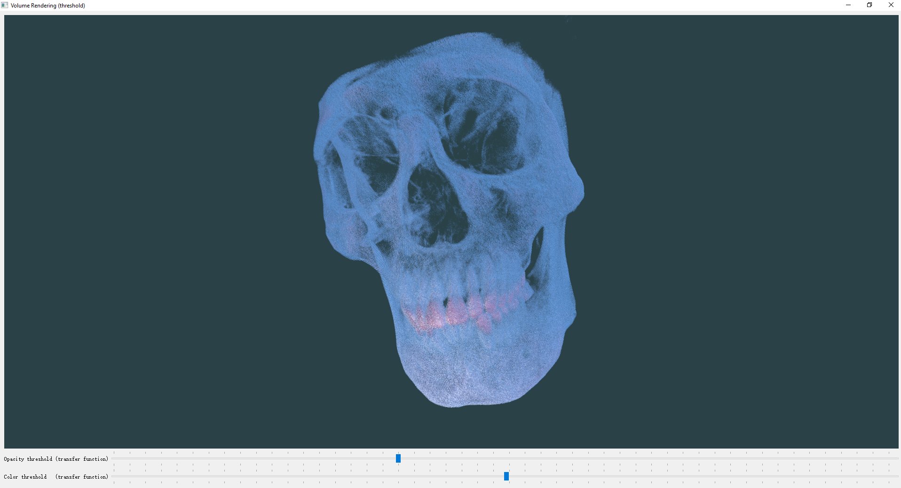

# Volume Rendering 纯 C++ 实现

Raycasting 实现的 Volume Rendering 算法。

## 数据下载

一份 CBCT 数据，在 [upupming/marching-cubes 的 Release 中](https://github.com/upupming/marching-cubes/releases/tag/v0.0.1)下载并放入 [data](data) 文件夹下。

## 基本知识

> 看不了公式可以访问 HTML 页面: http://upupming.site/volume-rendering

> Raycasting is not the same as raytracing! Raycasting is a fast semi-3D technique that works in realtime even on 4MHz graphical calculators, while raytracing is a realistic rendering technique that supports reflections and shadows in true 3D scenes, and only recently computers became fast enough to do it in realtime for reasonably high resolutions and complex scenes.

Raycasting 和 Raytracing 有区别，前者用来直接渲染体数据，后者则是用来对表面（例如 mesh 数据）进行渲染，获得具有阴影等真实的结果。

在 Raycasting 中，两个东西非常重要：

- Transfer function: A function that **maps** the information from every point q(t) along the ray to a color and opacity (RGBA) value
- Ray function: The ray function F is used to **combine** the scalar values along a ray, together with the application of the transfer function f, and produce a single RGBA value per ray

首先我们需要从眼睛发出一些光，最开始这道光颜色值和不透明度（RGBA）都是 0，然后打到一个 `zNear` 平面上表示我们最终看到的坐标在屏幕上是什么。然后穿透整个体数据，在这个过程中遇到的每个体素都是一个 scalar value，CT 数据对应的就是它的 hounsfield unit 值，我们可以根据这个值给他分配一个 RGBA 值，这就是传输函数（Transfer function），当然这是最简单的一维传输函数，复杂的二维传输函数可以根据梯度值等定义。我们可以把一路上遇到的所有的传输函数值作为 depth 的函数记录下来，记录下来之后，我们利用光线函数（Ray function）将这条光线所通过的所有的 RGBA 值做一个变换变成一个 RGBA 值，这个过程可以是求最大值（对应的结果就是 Max Intensity Project），可以是 First value >= threshold，这样得到的就是表面，也可以是平均值、求和等其他操作。

## Ray function

### Alpha blending (Compositing function)

算是最复杂的一种 Ray function，因为可以定义每一个体素的颜色和不透明度值，理论上传输函数调节的好的话可以得到任意的接近现实的想要的结果。

具体的光线传输和吸收公式就不推导了，可以参考 [Real-Time Volume Graphics](materials/Real-Time%20Volume%20Graphics.pdf)，最终可以得到光线的颜色计算公式：

$$
\tilde{C} = \sum_{i=0}^n\alpha_iC_i\prod_{j=0}^{i-1}(1-\alpha_j)
$$

- 这个公式可以理解为，一条从眼睛射出的光线打到体素上，交点分别为 $0, 1, \cdots, n$，第 $i$ 个点到达眼睛的时候要经过前面 $0 \cdots (i-1)$ 这些体素的遮挡，最终的到达眼睛处的颜色值要乘上这所有体素的透明度之积。
- 注意这里的 $\alpha C$ 被称之为 *opacity-weighted color*，也就是已经乘以过透明度之后的颜色，在这个颜色上进行插值得到的结果是比较好的。在看相关资料的时候一定要注意上下文判断到底 $C$ 是已经乘过透明度还是没有乘过，我这里统一都是没有乘过，和代码实现相对应。

#### Back-to-Front

递推公式更加简单，不需要处理不透明度的递推。

用 $C_i$ 表示第 $i$ 个点的颜色，$C_i'$ 表示从 $i \cdots n$ 的 compositing 颜色，$\alpha$ 表示不透明度，递推公式为

$$
\begin{aligned}
    C'_{i} = \alpha_i C_i + (1 - \alpha_i) C'_{i+1}
\end{aligned}
$$

极端情况：

- 当 $\alpha_i = 0$ 时，当前点完全透明，更新后完全等于后面的颜色，$C'_{i} = C'_{i+1}$
- 当 $\alpha_i = 1$ 时，当前点完全不透明，更新后完全等于这个点的颜色，$C'_{i} = \alpha C$

初始条件（背景色） $C'_n = 0$

根据数学归纳法不难证明：

$$
\begin{aligned}
    C'_0 &= \alpha_0 C_0 + \left(1-\alpha_0\right)C'_1 \\
         &= \alpha_0 C_0 + \left(1-\alpha_0\right)\left(\alpha_1 C_1 + \left(1-\alpha_1\right)C'_2\right) = \alpha_0 C_0 + \left(1-\alpha_0\right)\alpha_1 C_1 + \left(1-\alpha_0\right)\left(1-\alpha_1\right)C'_2\\
         \vdots \\
         &= \alpha_0 C_0 + \left(1-\alpha_0\right)\alpha_1 C_1 + \left(1-\alpha_0\right)\left(1-\alpha_1\right)\alpha_2 C_2 + \cdots + \prod_{j=0}^{n-1}\left(1-\alpha_j\right)\alpha_nC_n
\end{aligned}
$$

#### Front-to-Back

需要同时处理不透明度的递推，但是可以在不透明度累积到 1 时终止（early ray termination），效率更高。

用 $C_i$ 表示第 $i$ 个点的颜色，$C_i'$ 表示从 $0 \cdots i$ 的 compositing 颜色，$\alpha$ 表示不透明度，递推公式为

$$
\begin{aligned}
    C'_{i} &= C'_{i-1} + (1 - \alpha'_{i-1}) \alpha_i C_i \\
    \alpha'_{i} &= \alpha'_{i-1} + (1 - \alpha'_{i-1}) \alpha_i \\
\end{aligned}
$$

极端情况：

- 当 $\alpha_i = 0$ 时，当前点完全透明，更新后完全等于前面的颜色，$C'_{i} = C'_{i-1}$，$\alpha'_{i} = \alpha'_{i-1}$
- 当 $\alpha_i = 1$ 时，当前点完全不透明，更新后，$C'_{i} = C'_{i-1} + (1-\alpha'_{i-1}) C_i$，$\alpha'_{i} = 1$

初始条件（背景色）：

$$
\begin{cases}
    C'_0 &= 0 \\
    \alpha'_0 &= 0 \\
\end{cases}
$$

先把 $\alpha'$ 的递推公式等价变形成 $1 - \alpha'_{i} = (1 - \alpha'_{i-1}) (1 - \alpha_i)$

然后根据数学归纳法不难证明：

$$
\begin{cases}
    C'_i &= C_1 + (1-\alpha_1)\alpha_2 C_2 + \cdots + \left(\prod_{j=0}^{i-1}(1-\alpha_j)\right)\alpha_iC_i \\
    1 - \alpha'_i &= \prod_{j=0}^{i}(1-\alpha_j)
\end{cases}
$$

## image-order vs object order

- image-order (ray-casting): divides the resulting image into pixels and then computes the contributions of the entire volume to each pixel
- object order (graphics hardware): divides the objects into primitives and then calculates which set of pixels are influenced by a primitive

## 3D texture proxy geometry

- The biggest advantage of using view-aligned slices and 3D textures for volume rendering is that hardware-accelerated tri-linear interpolation is employed for resampling the volume at arbitrary locations.
- Apart from better image quality compared to bi-linear interpolation, this allows the rendering of slices with arbitrary orientation with respect to the volume, making it possible to maintain a constant sampling rate for all pixels and viewing directions.
- Additionally, a single 3D texture suffices for storing the entire volume, if there is enough texture memory available.

## 踩坑

1. `glTexImage3D` 的 `depth` 参数才是数组的第一维，如果传错了会导致索引出现混乱。
    1. 如果要传入 `unsigned short` 数据，需要使用 `usampler3D`，直接使用 `sampler3D` 的话，得到的结果全是 0。参考: https://stackoverflow.com/a/23410610/8242705

## 参考资料

1. [CUDA CMake](https://cliutils.gitlab.io/modern-cmake/chapters/packages/CUDA.html)
2. [RenderDoc graphics debug tool](https://github.com/baldurk/renderdoc)
3. [Coding Challenge #146: Rendering Raycasting](https://www.youtube.com/watch?v=vYgIKn7iDH8)
4. https://lodev.org/cgtutor/raycasting.html
5. [Ray Casting versus Ray Tracing (Volumetric): A Quick and Convenient Comparison](https://www.youtube.com/watch?v=ll4_79zKapU)
6. [Ray Functions for Volume Rendering: A Quick and Convenient Review](https://www.youtube.com/watch?v=1PqvwOjnKJw)
7. [Visualization Lecture 11.2. Ray Casting, Ray Functions, Transfer Functions, Direct Volume Rendering](https://www.youtube.com/watch?v=Thk-MiBIZpE)
8. [data visualization: principles and practice](https://books.google.com.hk/books?id=AGjOBQAAQBAJ&printsec=frontcover)
9. Data Vis Book
10. [Chapter 39. Volume Rendering Techniques](https://developer.nvidia.com/gpugems/gpugems/part-vi-beyond-triangles/chapter-39-volume-rendering-techniques)
11. https://cgl.ethz.ch/teaching/former/scivis_07/Notes/Handouts/03-raycasting.pdf
12. [slab 光线和 box 求交法](materials/03raytracing1.pdf)
